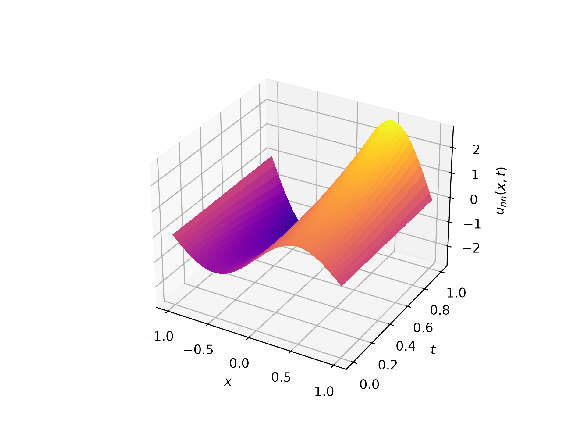
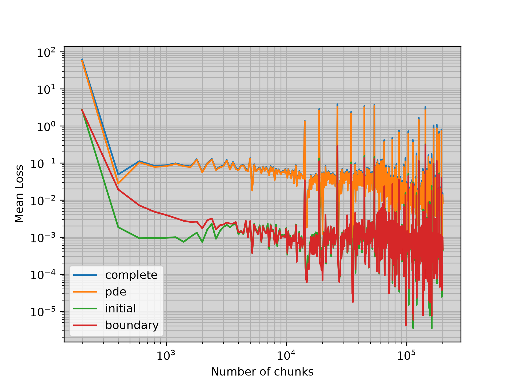
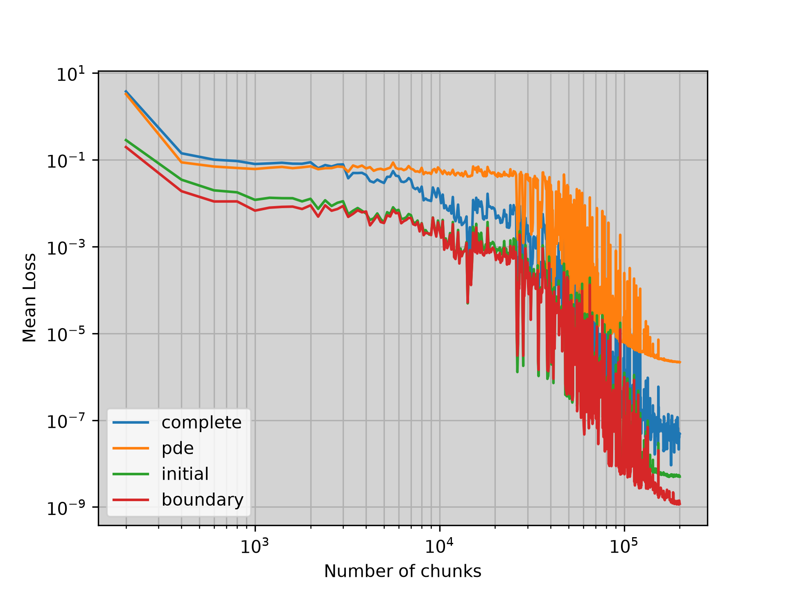

# Evaluating Physics-Informed Neural Networks (PINNs) for One-Dimensional Pseudo-Parabolic PDEs

**Key results**
- Transfers the PINN training strategies of Wang et al. [1] (Fourier feature embeddings, random weight factorization, GradNorm, causal loss weighting) from parabolic to pseudo-parabolic PDEs.
- These strategies reduce the maximum-norm error from 9.4e-02 to 2.1e-04 (about 450x) on a test problem with known exact solution.
- Errors are measured in the maximum, $L^2$ and $H^1$ norms using Gauss–Lobatto quadrature, not only via the training loss.
- Tech stack: Python, PyTorch (CUDA), pytest, Docker / Dev Container.

## Introduction
In recent years, neural networks for approximating the solution of 
partial differential equations have become an active area of research. 
A substantial impact on the research was the introduction
of PINNs by Raissi et al., cf. [2]. 
In [1], Wang et al. proposed training strategies to improve the results for computing 
approximate solutions for parabolic equations by PINNs. In the presented project we evaluate 
whether the training strategies introduced in [1] can also be applied
to one-dimensional pseudo-parabolic partial differential equations. In our experiments
we focus on the following class of pseudo-parabolic equations: Given a bounded interval 
$\Omega \coloneqq (\alpha, \beta) \subset \mathbb{R}$, continuous functions $a, c \in C([\alpha, \beta])$ and 
a source function $F:[0,T] \to C([\alpha, \beta])$, which is also continuous on $[0,T]$,
find a function $u:[\alpha,\beta] \times [0,T] \to \mathbb{R}$ that satisfies

```math
\begin{align*}
-u_{xxt} + au_t - u_{xx} + cu &= F \quad &&\text{on } \mathbb{Q} \coloneqq (\alpha,\beta) \times (0,T] \\
u(x,0) &= u_0(x) \quad &&\text{on } \overline{\Omega} \\
u(x,t) &= 0 \quad &&\text{for } (x,t) \in \{\alpha, \beta\} \times [0,T], 
\end{align*}
```

where $u_t$ denotes the partial derivative with respect to the time
variable $t$. Similarly, $u_{xx}$ denotes the second derivative of $u$ with respect to the space variable $x$. We assume that $a \geq 0$ on 
$\overline{\Omega}$, $u_0 \in C^1([\alpha, \beta])$ and $u_0(\alpha) = u_0(\beta) = 0$. Under these assumptions, 
our pseudo-parabolic equation possesses a unique solution $u$, cf. [3].

Our goal is to evaluate an approximate solution $u_{nn}: \mathbb{Q} \to \mathbb{R}$ generated by a 
PINN training algorithm. 

## Features
The implementation provides the following functionality:

- **Physics-Informed Neural Networks (PINNs)** for one-dimensional pseudo-parabolic partial differential equations of the presented type.
- **PyTorch implementation** with automatic differentiation for computing arbitrary spatial and temporal derivatives.
- **Modular PDE framework** that can easily be extended to further time-dependent PDEs, such as parabolic equations.
- Storage of training history, validation errors, and visualization of the training process.
- Object-oriented and fully type-annotated Python implementation.
- Optional **two-stage optimization** using Adam followed by L-BFGS for fine-tuning.
- **PyTest-based unit tests** for validating core numerical components, training routines, and evaluation utilities.

The following tools introduced in [1] are implemented in order to enhance the training of the PINN:

- **Random Fourier Feature Embeddings (RFFEs)**.
- **Random Weight Factorization (RWF)**.
- **Gradient-Norm balancing (GradNorm)** for adaptive weighting of the individual loss terms.
- **Segmental (causal) PDE loss weighting**, following the training strategy proposed by Wang et al.
- **Learning-rate scheduling** via exponential decay.

To evaluate the quality of the approximation $u_{nn}$ the following numerical tools are provided:

- Computation of the
  - maximum norm error,
  - $L^2$-norm error,
  - $H^1$-norm error.
- **Object-oriented quadrature framework** for evaluating integral-based error norms:
    - **Gauss–Lobatto quadrature** is already implemented 
    - allows a straightforward implementation of additional quadrature rules.

## Project Structure
```text 
.
├── results                         # Folder to save evaluation data
│   └── pseudo_parabolic            
├── src
│   └── pseudo_parabolic_pinn       # Main Python package
│       ├── examples                # Example scripts demonstrating the package
│       ├── neuronal_network        # PINN architecture, training and evaluation 
│       │   ├── data_classes        # Configuration and data classes
│       │   └── loss_modules        # Loss functions with adaptive weighting strategies
│       ├── numerical_utilities     # Numerical utilities classes
│       │   └── quadrature          # Numerical quadrature rules
│       └── pde_classes             # Abstract and concrete PDE classes
├── tests                           # PyTest unit tests
└── .devcontainer                   # Development container configuration
```

## Installation

**Requirements**
- Python 3.13 or newer
- NVIDIA GPU with a compatible driver (optional, recommended)
- Docker (optional)

The project is implemented in **Python** using **PyTorch**. This project uses the CUDA 13.2 PyTorch wheels specified in `requirements.txt`. To use GPU acceleration, a compatible NVIDIA GPU and driver are required. 
Linux or WSL2 are recommended for the project.

The project can be used in two different ways. 

**Installation on your system or in a virtual environment:**
- Install the packages required via
```
pip3 install -r requirements.txt
```

**Using Docker or Devcontainer**:
A Dockerfile as well as a .devcontainer.json file are provided. If GPU acceleration inside the container is required, install the NVIDIA Container Toolkit:

https://docs.nvidia.com/datacenter/cloud-native/container-toolkit/latest/install-guide.html

To run the code inside a Docker container build a Docker image via:

``` 
docker build -t pseudo-parabolic-pinn:latest .
```

If you use Visual Studio Code you can run the code inside a Devcontainer environment:

```
code pseudo-parabolic-pinn.code-workspace
```

## Quickstart
The project provides the script `demonstration.py`, which illustrates the general workflow of the project. It is located in 
`src/pseudo_parabolic_pinn/examples`. The script performs the following steps:

- defines a `device` where tensors and the PINN are stored
- defines a pseudo-parabolic problem
- creates a PINN
- trains the network
- evaluates the approximation error

Run the example via

```
python3 -m src.pseudo_parabolic_pinn.examples.demonstration
```

To run the example inside a Docker container, use 

```
docker run --rm --gpus all --mount type=bind,source=./,target=/home/teli/workspace/ pseudo-parabolic-pinn:latest python3 -m src.pseudo_parabolic_pinn.examples.demonstration
```

## Results
The results presented in this section are generated by the `pseudo-parabolic.py` script in `src/pseudo_parabolic_pinn/examples`. The pseudo-parabolic 
problem considered therein reads as follows: Find $u$ satisfying

```math
\begin{align*}
-u_{xxt} + \mathrm{e}^xu_t - u_{xx} + (x^2-1)u &= F(x,t) \quad &&\text{on } (-1,1) \times (0,1] \\
u(x,0) &= \sin(x\pi) \quad &&\text{on } [-1,1] \\
u(x,t) &= 0 \quad &&\text{for } (x,t) \in \{-1, 1\} \times [0,1], 
\end{align*}
```

The source function $F$ is defined such that $u(x,t) = \mathrm{e}^t \sin(x\pi)$ is the solution of the problem. The following two figures illustrate the exact solution and the prediction of the model.

Exact solution             |  Model prediction
:-------------------------:|:-------------------------:
  |  

Three experiments were conducted. In the first one, a general PINN network without modifications specified in the `Features` section is trained. The second experiment employs all training strategies described 
in the `Features` section while using only the Adam optimizer. In the last one, the modifications and two-step optimization using Adam and
L-BFGS are employed to train the model. In all three experiments, 200000 epochs of training are performed. In the third experiment, the last 500 of these epochs are performed with L-BFGS. Unless stated otherwise, all hyperparameters are chosen according to [1]. 
The following table summarizes the results.

|                                                 |  maximum-norm error | $L^2$-norm error | $H^1$-norm error |
|:------------------------------------------------|:-------------------:|:----------------:| :---------------:|
|PINN without modifications                       |      9.402e-02      |     8.146e-02    |     1.230e-01    | 
|PINN with modifications but only Adam            |      2.086e-04      |     1.145e-04    |     2.520e-03    |
|PINN with modifications and two-step optimization|      4.333e-04      |     2.741e-04    |     3.039e-03    |

Among the three configurations, the PINN employing the proposed training strategies together with the Adam optimizer achieves the smallest approximation errors. 
The worst results are obtained using a training without any modifications. Interestingly, the two-stage optimization yields slightly larger errors than the training using only the Adam optimizer. Since the network parameters are initialized randomly, 
this observation may be caused by the particular initialization used in this experiment. Averaging the errors over multiple independent training runs (e.g., 100 runs) could lead to different conclusions.

The following figures compare the training losses of the standard PINN and the modified training procedure. To improve readability, every plotted value represents the average loss over 200 consecutive training epochs.

Without modifications            | With modifications but only Adam
:-------------------------:|:-------------------------:
  |  

The curves are associated with the following losses, cf. [1]:
- blue -> Complete loss
- orange -> PDE loss
- green -> Initial loss
- red -> Boundary loss

Note that in the second figure the complete loss is smaller than the PDE loss. As described in [1], the complete loss is computed as

```math
\begin{gather*}
\mathrm{loss}_\mathrm{complete} = \lambda_\mathrm{pde} \mathrm{loss}_\mathrm{pde} + \lambda_\mathrm{initial} \mathrm{loss}_\mathrm{initial} + \lambda_\mathrm{boundary} \mathrm{loss}_\mathrm{boundary},
\end{gather*}
```

where $\lambda_\mathrm{pde}, \lambda_\mathrm{initial} \text{ and } \lambda_\mathrm{boundary}$ describe non-negative, adaptive loss weights. Since all weights are non-negative, we have $\mathrm{loss}_\mathrm{complete} \geq \lambda_\mathrm{pde}\,\mathrm{loss}_\mathrm{pde}$. Hence, 
```math
\begin{gather*}
\mathrm{loss}_{\mathrm{complete}}<\mathrm{loss}_{\mathrm{pde}}
\end{gather*}
``` 
implies that $\lambda_\mathrm{pde} < 1$. Note that a small training loss does not by itself guarantee a small approximation error, since the loss only measures squared residuals at the sampled training points. Therefore, the errors are evaluated separately in the maximum, $L^2$ and $H^1$ norms. 

## Literature
[1] Wang, S., Sankaran, S., Wang, H., and Perdikaris, P.
    An Expert's Guide to Training Physics-Informed Neural Networks.
    [arXiv:2308.08468](https://arxiv.org/abs/2308.08468), 2023.

[2] Raissi, M., Perdikaris, P., and Karniadakis, G. E.
    Physics-informed neural networks: A deep learning framework for solving
    forward and inverse problems involving nonlinear partial differential equations.
    Journal of Computational Physics, 378:686–707, 2019. [doi:10.1016/j.jcp.2018.10.045](https://doi.org/10.1016/j.jcp.2018.10.045)

[3] Ossadnik, M. and Linß, T.
    A posteriori error bounds for pseudo-parabolic equations using $C_0$ semigroups
    [arXiv:2606.20073](https://arxiv.org/abs/2606.20073), 2026